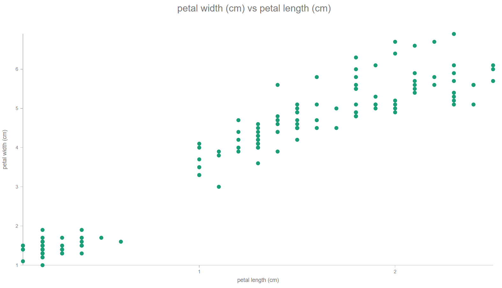
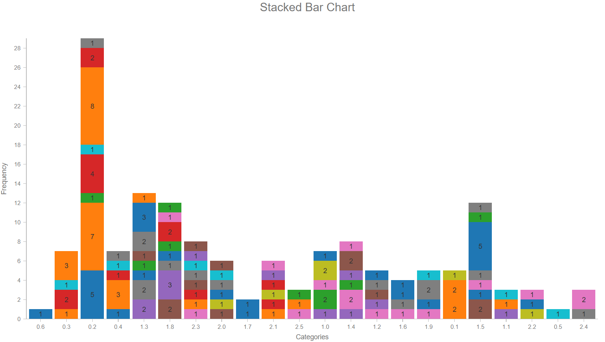

# Rasuka (Rust Kaiseki)
Rasuka is a command-line application designed to help you analyze data by generating visualizations and performing descriptive statistics. Since rust performs faster than python, it will be time efficient for quick analyze data. It supports generating scatter plots, barplots, and describing data.

This is the first Rust program I made, and it’s a project I created to learn and explore the Rust programming language. 
It is a work in progress, and I welcome contributions, feedback, or suggestions as I am still new in rust programming. 

# Features
Scatter Plot: Generates a scatter plot of the specified x and y columns from your dataset. <br>
Bar Plot: Generates a histogram for visualizing frequency also the relationship between two specified parameters. <br>
Describe: Outputs descriptive statistics (mean, standard deviation, etc.) for the specified data column. <br>

# Installation
1. Clone this repository to your local machine:<br>
```git clone https://github.com/yourusername/rasuka.git```

2. Change to the project directory:<br>
```cd rasuka```

3. Build and run the application using Cargo (Rust's package manager and build system):<br>
```cargo build```

4. Run the application:<br>
```cargo run -- -p path/to/your/data.csv -x column_name_x -y column_name_y --scatter```

# Usage
Command-line Arguments<br>
-p or --path: Path to the dataset file (CSV format).<br>
-x or --paramx: The column name for the x-axis parameter.<br>
-y or --paramy: The column name for the y-axis parameter.<br>
--scatter: Generates a scatter plot of the data.<br>
--barplot: Generates a bar plot of the data.<br>
--describe: Outputs descriptive statistics for the specified data column.

Example usage:<br>
```cargo run -- -p iris.csv -x "petal width (cm)" -y "petal length (cm)" scatter```<br>
```cargo run -- -p iris.csv -x "petal width (cm)" -y "petal length (cm)" barplot```<br>
The plot visulaization result will be saved under .svg format<br>

As for now, the reuslt of the visualization will look something like this

<br>


As for the barplot, the y-axis on the visulaization is the frequency and the passed -y parameter will become the group colour of the bars. 

# Contributing
Feel free to open issues or submit pull requests if you have suggestions or improvements.<br>
Since this is my first Rust project, please go easy on me and any feedback would be greatly appreciated!

License
Distributed under the MIT License. See LICENSE for more information.
